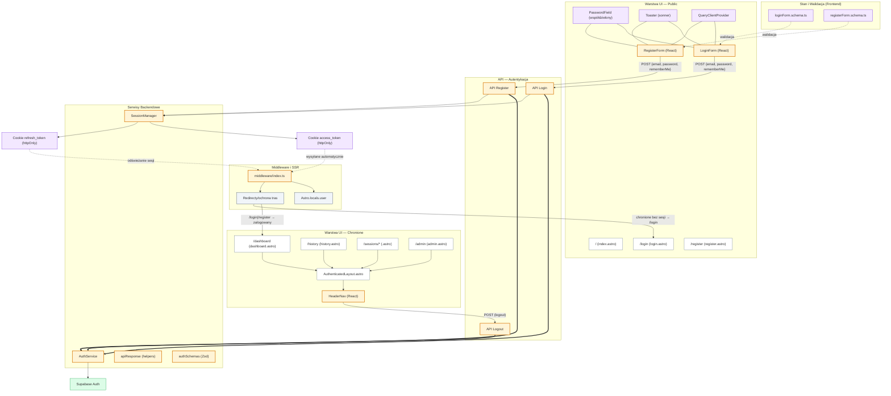

<architecture_analysis>

1) Lista komponentów i elementów (wg PRD i auth-spec + kodu):
- Strony publiczne: `src/pages/index.astro`, `src/pages/login.astro`, `src/pages/register.astro`
- Strony chronione: `src/pages/dashboard.astro`, `src/pages/history.astro`, `src/pages/sessions/*.astro`, `src/pages/admin.astro`
- Layouty: `src/layouts/Layout.astro`, `src/layouts/AuthenticatedLayout.astro`
- Komponenty React (auth): `src/components/auth/LoginForm.tsx`, `src/components/auth/RegisterForm.tsx`, `src/components/auth/PasswordField.tsx`
- Komponent layoutu/nawigacji: `src/components/layout/HeaderNav.tsx`
- Walidacja UI (Zod): `src/lib/validation/ui/loginForm.schema.ts`, `src/lib/validation/ui/registerForm.schema.ts`
- Provider i UI pomocnicze: `src/lib/providers/QueryClientProvider.tsx`, `src/components/ui/sonner` (Toaster)
- Middleware: `src/middleware/index.ts`
- Supabase client: `src/db/supabase.client.ts`
- (Do utworzenia) API auth: `src/pages/api/auth/register.ts`, `src/pages/api/auth/login.ts`, `src/pages/api/auth/logout.ts`
- (Do utworzenia) Serwisy backend: `src/lib/services/auth/authService.ts`, `src/lib/services/auth/sessionManager.ts`
- (Do utworzenia) Walidacja API i helpery: `src/lib/validation/api/authSchemas.ts`, `src/lib/utils/apiResponse.ts`

2) Główne strony i powiązane komponenty:
- `/login` → `Layout.astro` + `LoginForm` + `Toaster` (+ `QueryClientProvider` jako wyspa)
- `/register` → `Layout.astro` + `RegisterForm` (z `PasswordField`, wskaźnik siły hasła) + `Toaster` (+ `QueryClientProvider`)
- `/dashboard` → `AuthenticatedLayout.astro` (z `HeaderNav`) + widok treści (np. `DashboardView`)
- `/history`, `/sessions/*`, `/admin` → `AuthenticatedLayout.astro` (z `HeaderNav`) + odpowiednie widoki

3) Przepływ danych (stan docelowy po wdrożeniu specyfikacji):
- Login/Rejestracja: `LoginForm`/`RegisterForm` → (POST) API Login/Register → `AuthService` (Supabase) → `SessionManager` ustawia `access_token` + `refresh_token` w httpOnly cookies → przeglądarka → `middleware` czyta cookies i weryfikuje → `Astro.locals.user` dostępny na stronach chronionych.
- Wylogowanie: `HeaderNav` → (POST) API Logout → `AuthService.signOut()` → `SessionManager.clearSession()` → redirect do `/login`.
- Ochrona tras i SSR: `middleware` przepuszcza `/`, `/login`, `/register`; zalogowanych z `/login|/register` przekierowuje do `/dashboard`; niezalogowanych z tras chronionych przekierowuje do `/login` (z `?redirect=`).
- Walidacja UI: `loginForm.schema.ts` i `registerForm.schema.ts` zapewniają inline validation; toasty błędów/sukcesu przez `sonner`.

4) Krótki opis kluczowych elementów:
- `LoginForm`: formularz logowania (email, password, rememberMe), docelowo wysyła do API Login.
- `RegisterForm`: rejestracja + auto-login, docelowo przez API Register; wskaźnik siły hasła.
- `PasswordField`: współdzielony input hasła (show/hide, ARIA).
- `HeaderNav`: nawigacja zalogowanego; wylogowanie przez API Logout.
- `AuthenticatedLayout`: layout stron chronionych, osadza `HeaderNav`.
- `middleware/index.ts`: weryfikuje sesję (cookies/Authorization), ustawia `locals.supabase` i `locals.user`, wykonuje redirecty.
- `AuthService` (backend): centralizuje wywołania `supabase.auth.*` (signUp/signIn/signOut).
- `SessionManager` (backend): zarządzanie httpOnly cookies (`access_token`, `refresh_token`, Max-Age wg `rememberMe`).
- `authSchemas` (API): Zod schematy requestów do API auth.
- `apiResponse` (API): spójne helpery odpowiedzi (success/error/validation).

Wyróżnienia (wymagają aktualizacji/utworzenia): `LoginForm`, `RegisterForm`, `HeaderNav`, `middleware/index.ts`, API auth, `AuthService`, `SessionManager`, `authSchemas`, `apiResponse`.

</architecture_analysis>

<mermaid_diagram>

</mermaid_diagram>
