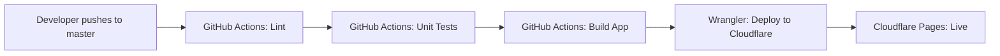

# Cloudflare Pages Deployment Implementation Summary

## ✅ Changes Completed

### 1. Master CI/CD Workflow Created

Created `.github/workflows/master.yml` with the following pipeline:

```
Push to master → Lint → Unit Tests → Deploy to Cloudflare Pages
```

**Key Features:**
- Automatic deployment on every push to `master` branch
- Runs lint and unit tests before deployment
- Uses Cloudflare Pages direct upload API
- Builds with production environment variables
- Deploys to project: `10x-pull-up-trainer`
- Uses `production` branch in Cloudflare Pages

### 2. GitHub Actions Updated to Latest Versions

All actions verified and updated to latest stable versions:

| Action | Version | Status |
|--------|---------|--------|
| `actions/checkout` | v5 | ✅ Latest |
| `actions/setup-node` | v6 | ✅ Latest |
| `actions/upload-artifact` | v5 | ✅ Updated |
| `actions/download-artifact` | v5 | ✅ Latest |
| `cloudflare/wrangler-action` | v3 | ✅ Latest |

**Verification Performed:**
- ✅ All actions are active (not archived)
- ✅ Using latest major versions
- ✅ No deprecated parameters
- ✅ Correct configuration per official documentation

### 3. Pull Request Workflow Updated

Updated `.github/workflows/pull-request.yml`:
- Upgraded `actions/upload-artifact` from v4 to v5 for consistency
- All other actions already at latest versions

### 4. Documentation Created

Created comprehensive setup guide: `.github/CLOUDFLARE_DEPLOYMENT_SETUP.md`

**Includes:**
- Step-by-step configuration instructions
- Complete list of required GitHub secrets
- How to obtain each secret
- Troubleshooting guide
- Monitoring and rollback procedures

## 🔒 Required GitHub Secrets (Production Environment)

The following secrets must be configured in GitHub repository under:
**Settings > Secrets and variables > Actions > Environments > production**

### Cloudflare (2 secrets)
- `CLOUDFLARE_API_TOKEN` - API token with Pages write permissions
- `CLOUDFLARE_ACCOUNT_ID` - Cloudflare account ID

### Supabase (3 secrets)
- `PUBLIC_SUPABASE_URL` - Supabase project URL
- `PUBLIC_SUPABASE_ANON_KEY` - Supabase anonymous key
- `SUPABASE_SERVICE_ROLE_KEY` - Supabase service role key

### Application (2 secrets)
- `OPENROUTER_API_KEY` - OpenRouter.ai API key
- `PUBLIC_APP_URL` - Production app URL

## 📋 Workflow Comparison

### Pull Request Workflow (`pull-request.yml`)
- **Trigger:** Pull requests to master
- **Jobs:** Lint → Unit Tests + E2E Tests → Status Comment
- **Purpose:** Validate code quality and functionality before merge

### Master Workflow (`master.yml`)
- **Trigger:** Push to master
- **Jobs:** Lint → Unit Tests → Deploy to Cloudflare Pages
- **Purpose:** Automatically deploy validated code to production

## 🏗️ Existing Cloudflare Configuration (Verified)

The project already has proper Cloudflare support:

1. **`astro.config.mjs`**
   - ✅ Uses `@astrojs/cloudflare` adapter
   - ✅ Configured for Cloudflare Workers runtime
   - ✅ Edge rendering for production builds

2. **`wrangler.toml`**
   - ✅ Project name: `10x-pull-up-trainer`
   - ✅ Output directory: `dist`
   - ✅ Node.js compatibility enabled
   - ✅ Compatibility date: 2025-01-01

3. **`package.json`**
   - ✅ Build script: `npm run build`
   - ✅ Wrangler CLI available: `^4.45.0`
   - ✅ Environment-specific dev scripts

## 🚀 Deployment Flow



## 🔍 Best Practices Applied

### ✅ GitHub Actions Rules Followed

1. **Node.js Setup**
   - Uses `.nvmrc` file for version consistency (22.14.0)
   - Uses `npm ci` for faster, deterministic installations
   - Leverages npm caching for improved performance

2. **Environment Variables**
   - Set at job level, not globally (better isolation)
   - Uses GitHub Environments for secret management
   - Properly separates public vs. server-only secrets

3. **Security**
   - Minimal permissions (`contents: read`)
   - Secrets stored in GitHub Environments
   - No hardcoded credentials

4. **Action Versions**
   - All actions use latest major versions
   - Pinned to major versions (e.g., `v5`, not `v5.0.0`)
   - Verified actions are not deprecated or archived

5. **Workflow Efficiency**
   - Jobs run in parallel where possible
   - Dependencies defined with `needs`
   - Artifacts retained for 7 days only

### ✅ Cloudflare Best Practices

1. **Direct Upload API**
   - Uses `cloudflare/wrangler-action` for deployment
   - Direct upload via `pages deploy` command
   - Explicit project name and branch specification

2. **Build-Time Environment Variables**
   - All secrets available during build
   - Proper separation of public/private vars
   - Environment name explicitly set (`PUBLIC_ENV_NAME: prod`)

3. **Deployment Strategy**
   - Separate branch for production (`--branch=production`)
   - Consistent project naming
   - Automatic deployment after successful tests

## 📊 Verification Steps Completed

1. ✅ Verified all GitHub Actions are at latest major versions
2. ✅ Confirmed no actions are archived or deprecated
3. ✅ Validated `cloudflare/wrangler-action` parameters against official documentation
4. ✅ Checked existing Cloudflare configuration (no changes needed)
5. ✅ Ensured workflow follows GitHub Actions best practices
6. ✅ Updated both workflows for consistency

## 🎯 Next Steps for User

1. **Create Cloudflare Pages Project** (if not exists)
   ```bash
   npx wrangler login
   npx wrangler pages project create 10x-pull-up-trainer
   ```

2. **Configure GitHub Secrets**
   - Go to repository Settings > Environments
   - Create `production` environment
   - Add all 7 required secrets (see CLOUDFLARE_DEPLOYMENT_SETUP.md)

3. **Test Deployment**
   - Push a commit to `master` branch
   - Monitor workflow in Actions tab
   - Verify deployment in Cloudflare Dashboard

4. **Verify Application**
   - Access production URL
   - Test authentication with Supabase
   - Verify AI features with OpenRouter

## 📚 Documentation Files

1. **`.github/workflows/master.yml`**
   - Master branch CI/CD workflow
   - Automated deployment configuration

2. **`.github/workflows/pull-request.yml`**
   - Updated with latest action versions
   - Pull request validation workflow

3. **`.github/CLOUDFLARE_DEPLOYMENT_SETUP.md`**
   - Comprehensive setup guide
   - Step-by-step instructions
   - Troubleshooting tips

4. **`.github/DEPLOYMENT_SUMMARY.md`** (this file)
   - Overview of all changes
   - Technical details
   - Next steps

## 🎉 Implementation Complete

All tasks from the deployment plan have been successfully completed:

- ✅ Verified Cloudflare configuration (no changes needed)
- ✅ Created `master.yml` workflow with lint, unit-test, and deploy jobs
- ✅ Verified and updated GitHub Actions to latest major versions
- ✅ Validated `cloudflare/wrangler-action` configuration
- ✅ Updated `pull-request.yml` for consistency
- ✅ Created comprehensive documentation

The project is now ready for automated deployment to Cloudflare Pages! 🚀

